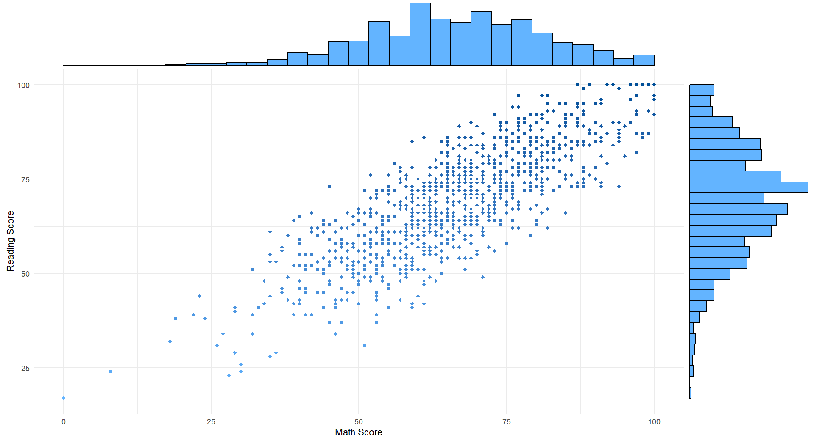
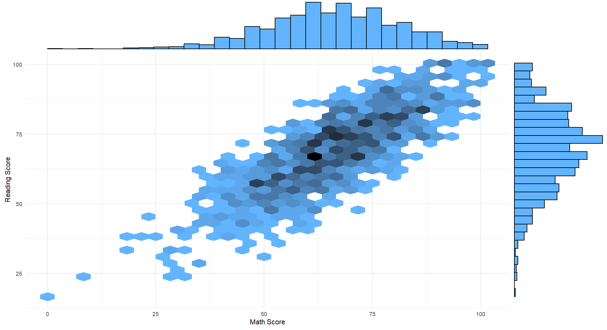
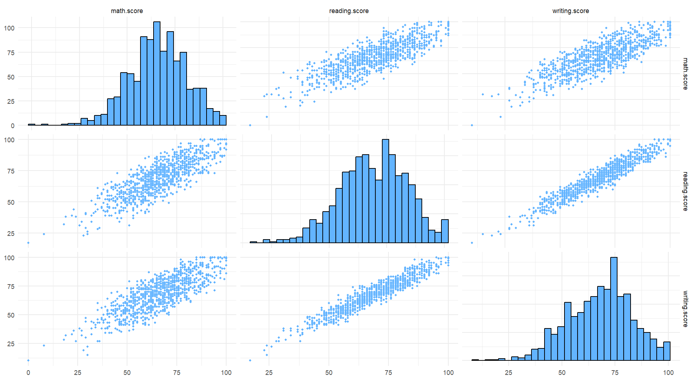
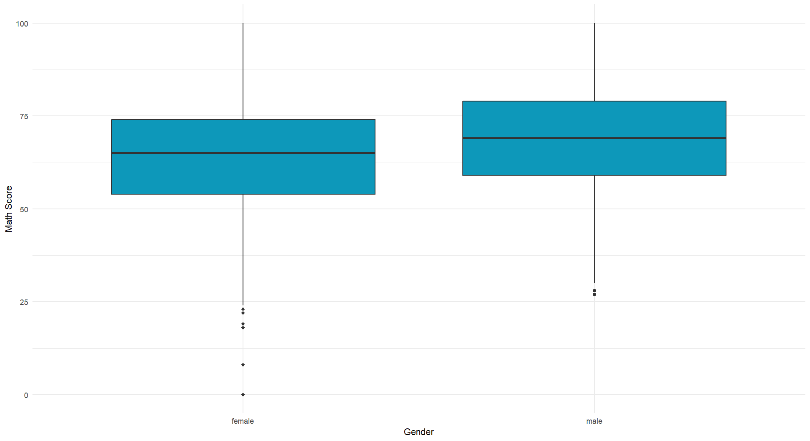
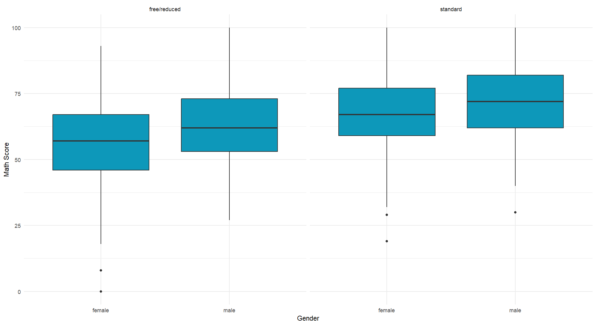
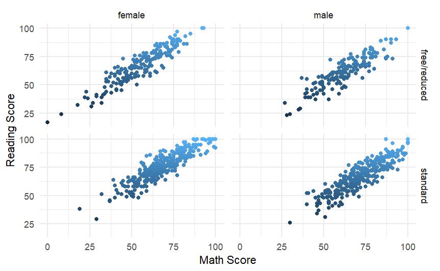
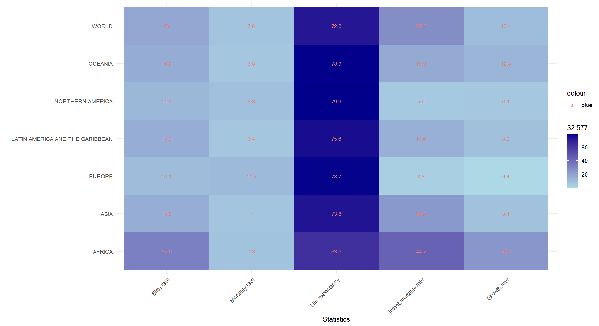

# Data Science R Plotting Assignment

This repository contains various R scripts for generating different types of plots. Each script is linked to its corresponding file, and the generated images are displayed below.

## Plots

### [1. 01_marginal_plot.R](https://github.com/foy4748/ds_R_plotting_assignment/blob/main//01_marginal_plot.R)

### [2. 02_marginal_plot_hex_points.R](https://github.com/foy4748/ds_R_plotting_assignment/blob/main//02_marginal_plot_hex_points.R)

### [3. 03_pair_plot.R](https://github.com/foy4748/ds_R_plotting_assignment/blob/main//03_pair_plot.R)

### [4. 04_box_plot_1.R](https://github.com/foy4748/ds_R_plotting_assignment/blob/main//04_box_plot_1.R)

### [5. 05_box_plot_2.R](https://github.com/foy4748/ds_R_plotting_assignment/blob/main//05_box_plot_2.R)

### [6. 06_line_plots.R](https://github.com/foy4748/ds_R_plotting_assignment/blob/main//06_line_plots.R)

### [7. 07_heat_map.R](https://github.com/foy4748/ds_R_plotting_assignment/blob/main//07_heat_map.R)

